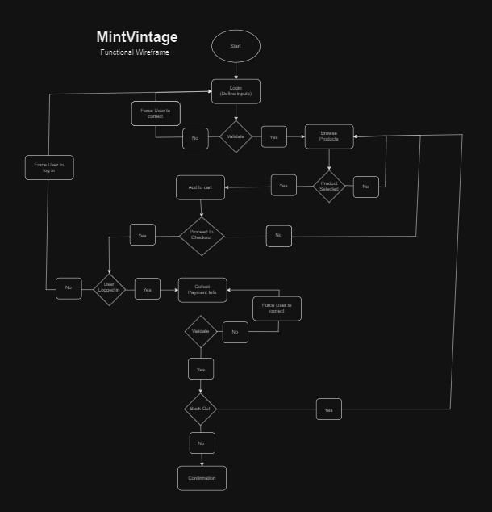
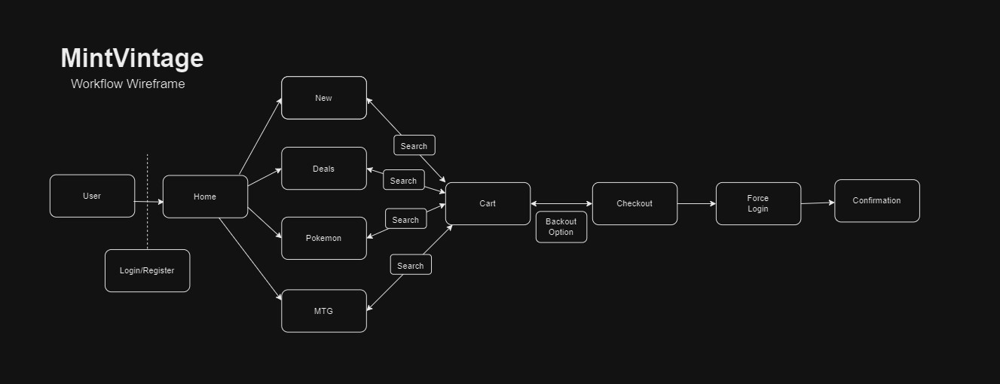

# MintVintage💎

**MintVintage** is a dynamic e-commerce platform showcasing my actual Pokémon and Magic: The Gathering cards. It blends sleek design with dynamic content loading and extensive JavaScript and jQuery to enhance user experience and interactivity.

---

## Features

- **Dynamic Content Loading**: Reads from a text file to populate card listings.
- **Interactive Shopping Cart**:
  - Add or remove items dynamically.
  - Displays total cost in real-time (no purchase functionality yet).
- **Login and Registration**:
  - RegEx validation ensures secure user input.
  - Auto-redirects new users to the registration form.
- **Contact Us Form**: Sends emails using Elastic Email and SMTPjs.
- **API Integrations**:
  - Pokémon API: Generates a random “Who’s That Pokémon” feature.
  - Scryfall API: Populates a dynamic Magic card art slideshow using Bootstrap.
- **Read From Textfiles**
  - Populates card data and images. 
---

## Technologies Used

- **Frontend**: HTML, CSS, JavaScript, Bootstrap
- **APIs**: Pokémon API, Scryfall API
- **Email Service**: SMTPjs, Elastic Email

---

## How to Run the Project

1. Visit the live site: [MintVintage](https://paxjupiter.github.io/MintVintage/)
2. Or clone the repo to run locally:
   ```bash
   git clone https://github.com/paxjupiter/MintVintage.git
   ```
3. Open `index.html` in your browser.

---

## Wireframes





---

## Future Enhancements

- Add real-time user authentication and database integration.
  - Will be using mySQL or PHP to manage card data
  - Implementation of search functionality so users can browse specific cards by name or type.
- Implement a secure payment gateway for checkout.
- Enhance the mobile-responsive design for seamless browsing.

---

## Acknowledgments

- **Pokémon API** and **Scryfall API** for their amazing free resources.
- Bootstrap for the responsive framework and carousel.

---

## License

This project is for educational purposes only and is not affiliated with Pokémon Company International or Wizards of the Coast.
